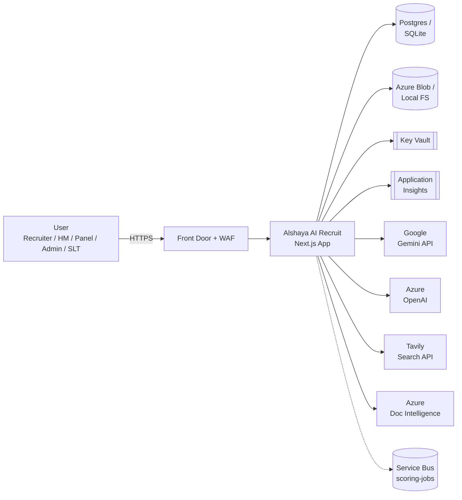
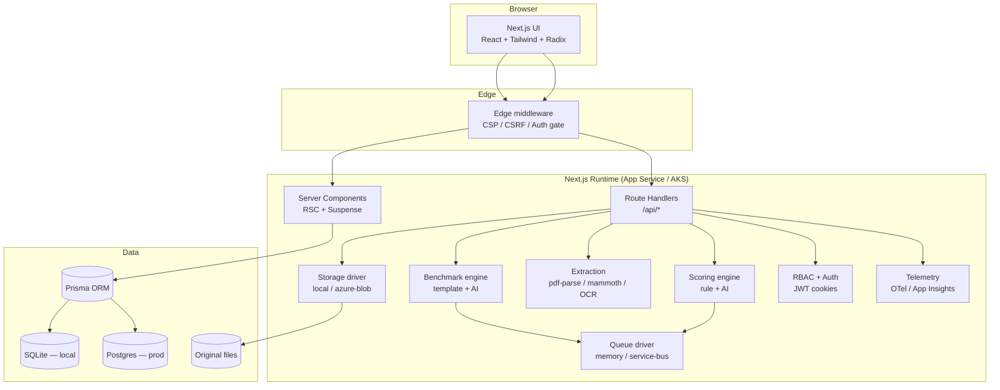
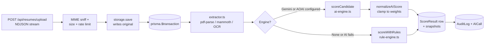
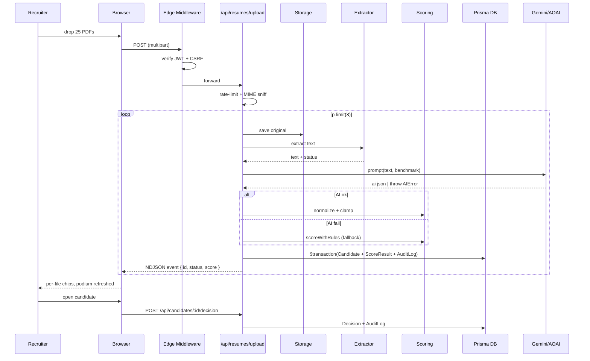
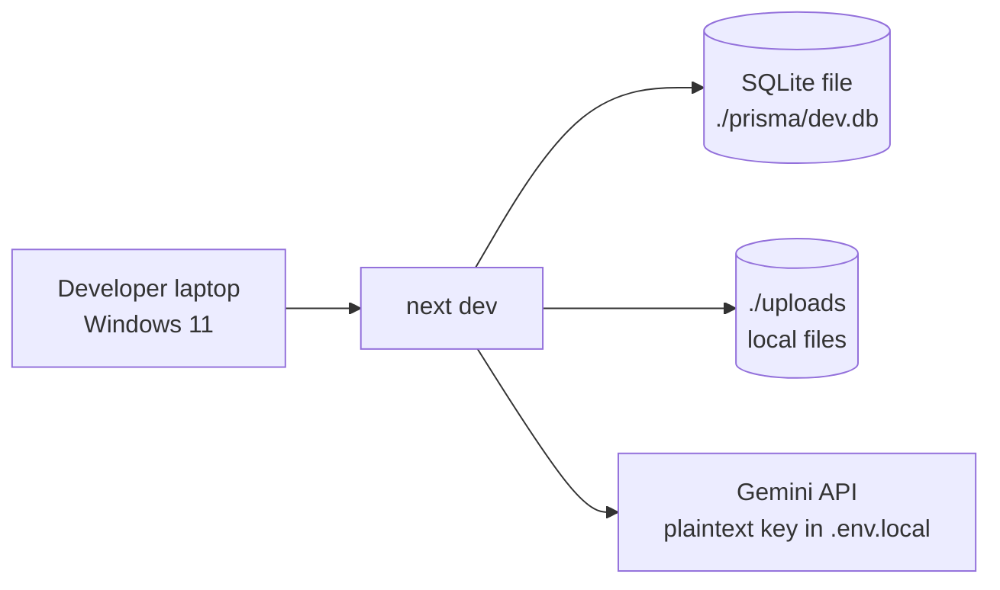
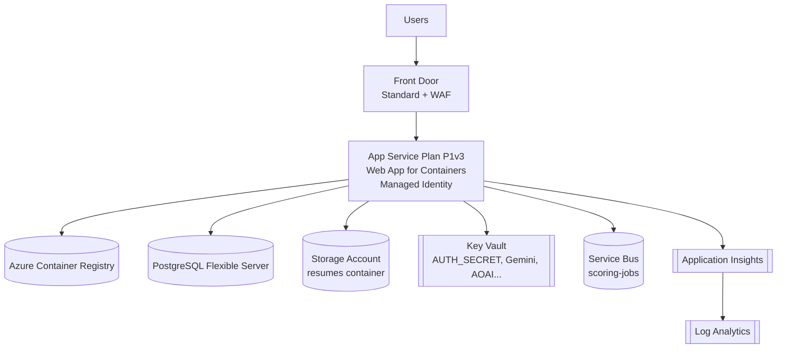

# Architecture

This document covers system context, container view, component view, key sequences,
and the local-vs-Azure deployment topology. All diagrams are inline mermaid so they
render in GitHub.

---

## 1. System context

---

## 2. Container view

---

## 3. Component view (scoring path)

---

## 4. Sequence: upload → score → decide

---

## 5. Local deployment

---

## 6. Azure deployment

---

## 7. Key architectural decisions

ADRs live under [`docs/ADR/`](./ADR/). Headline decisions:

- **ADR-0001 Next.js App Router** — server components for read paths, route handlers for mutations.
- **ADR-0002 SQLite-then-Postgres** — `provider = env("DATABASE_PROVIDER")` flip.
- **ADR-0003 Mock-then-Entra auth** — local cookie JWT now, NextAuth+Entra scaffold for cloud.
- **ADR-0004 Cookie JWT** — signed with `jose`, 7-day rotation, `__Host-` cookie in prod.
- **ADR-0005 Bounded concurrency scoring** — `p-limit(3)` to protect AI rate limits.
- **ADR-0006 Streamed upload** — NDJSON over a single HTTP connection.
- **ADR-0007 Typed `AIError`** — every failure carries `kind`, `provider`, `status`, `hint`.

---

## 8. Reliability budget

| Component | SLO | Failure mode | Mitigation |
|----------|-----|--------------|-----------|
| AI provider | 99 % | 429 / 5xx / 404 | Auto-fallback to local rule engine; logged as `AICall.ok = false`. |
| Postgres | 99.95 % | Connection storm | Prisma pool size capped; readiness probe returns 503. |
| Storage | 99.9 % | Blob throttling | Single retry + audit row marked `ipAddress`. |
| AuthN | 99.99 % | JWT key rotation | Dual-key rollover via `AUTH_SECRET_PREV` (planned). |
