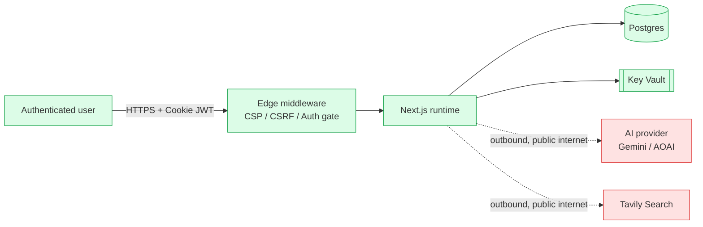

# Security

This document is the source-of-truth for how Alshaya AI Recruit protects user data,
AI keys, and the hiring pipeline. It follows the **STRIDE** threat-model framework
and maps to the **OWASP Top 10 (2021)** and the relevant **GDPR / UAE PDPL**
articles for candidate-data automation.

---

## 1. Trust boundaries



---

## 2. STRIDE threats and mitigations

| STRIDE | Threat | Mitigation |
|--------|--------|-----------|
| **S — Spoofing** | Forged session, replayed cookie | Signed JWT (`jose` / HS256, 32-byte `AUTH_SECRET`), 7-day expiry, `__Host-` cookie, `HttpOnly`, `SameSite=Strict`, `Secure` in prod. |
| **S — Spoofing** | Spoofed file extension to bypass parser | Server-side **MIME sniffing** via `file-type` package on every upload before extraction. |
| **T — Tampering** | Modify benchmark in transit | All mutating routes are POST/PATCH/DELETE behind **double-submit CSRF** + Zod-validated bodies. |
| **T — Tampering** | Modify score row to fast-track a candidate | Scores are written inside a `prisma.$transaction` together with `AuditLog`; no API surface allows direct update. |
| **R — Repudiation** | "I didn't shortlist that candidate" | `AuditLog` row per mutation with `userId`, `ipAddress`, `action`, `entityType`, `entityId`, `details`. |
| **I — Information disclosure** | List-all leak on `GET /api/candidates` | Every read route is wrapped in `requirePermission(...)` from `src/lib/rbac.ts`; data shaping is column-scoped. |
| **I — Information disclosure** | Original CV download by wrong role | `/api/candidates/:id/resume` requires `candidate:read` and streams via the storage abstraction (no raw disk path leaked). |
| **D — Denial of service** | Brute-force login | `LIMITS.login` token bucket (5/min/IP) in `src/lib/rate-limit.ts`. |
| **D — Denial of service** | Upload bomb (1000 files) | Hard cap of 50 files + 10 MB/file enforced server-side, and `LIMITS.upload` (20/h/user). |
| **D — Denial of service** | Benchmark spam | `LIMITS.benchmarkCreate` (10/h/user). |
| **E — Elevation of privilege** | Viewer triggers delete | `requirePermission('candidate:delete')` returns 403 before reaching the DB. |

---

## 3. OWASP Top 10 mapping

| OWASP-2021 | Where we address it |
|-----------|---------------------|
| A01 Broken access control | `src/lib/rbac.ts` (PERMISSIONS matrix). |
| A02 Cryptographic failures | `bcrypt` cost 12, JWT HS256 with 32-byte secret. |
| A03 Injection | Zod input validation in every route + Prisma parameterized queries. |
| A04 Insecure design | Threat model in this doc; design tokens enforce defaults. |
| A05 Security misconfiguration | `next.config.mjs` strips `X-Powered-By`, middleware adds CSP / HSTS / X-Frame-Options. |
| A06 Vulnerable & outdated components | Dependabot weekly + CodeQL extended. |
| A07 ID & auth failures | Rate limit on login, generic error message, hashed passwords. |
| A08 Software & data integrity | Lockfile committed; CI verifies `npm ci` + Prisma `validate`. |
| A09 Logging & monitoring | Structured `logger.ts` + App Insights connection string; every mutation in `AuditLog`. |
| A10 SSRF | No URL is fetched on behalf of the user; only Tavily (whitelisted host) and AI providers. |

---

## 4. Secret management

| Env var | Storage (local) | Storage (Azure) | Rotation |
|---------|----------------|-----------------|---------|
| `AUTH_SECRET` | `.env.local` (gitignored) | Key Vault secret `AUTH-SECRET` (App Service reference) | Every 90 days, dual-key rollover |
| `GOOGLE_GEMINI_API_KEY` | `.env.local` plaintext (per developer policy) | Key Vault `GOOGLE-GEMINI-API-KEY` | When suspected leak; revoke at Google AI Studio |
| `AZURE_OPENAI_API_KEY` | `.env.local` (optional) | Key Vault `AZURE-OPENAI-API-KEY` | Per Azure rotation policy |
| `TAVILY_API_KEY` | `.env.local` (optional) | Key Vault `TAVILY-API-KEY` | Per Tavily quota cycle |
| Postgres credentials | n/a (SQLite) | Key Vault + Managed Identity preferred | Per DBA policy |

**Rotation runbook** is in [`docs/RUNBOOK.md`](./RUNBOOK.md#secret-rotation).

---

## 5. Cookies

| Cookie | Purpose | Flags |
|--------|---------|-------|
| `__Host-session` (prod) / `session` (dev) | Signed JWT | `HttpOnly; Secure; SameSite=Strict; Path=/` |
| `csrf-token` | Double-submit token | `Secure; SameSite=Strict; Path=/` (readable to JS by design) |

---

## 6. HTTP headers (set by `src/middleware.ts`)

```
Content-Security-Policy: default-src 'self'; img-src 'self' data: blob:; ...
Referrer-Policy: strict-origin-when-cross-origin
Permissions-Policy: camera=(), microphone=(), geolocation=()
X-Content-Type-Options: nosniff
X-Frame-Options: DENY
Strict-Transport-Security: max-age=63072000; includeSubDomains; preload     // prod only
```

---

## 7. GDPR / UAE PDPL alignment

- **Lawful basis**: legitimate interest for internal recruitment; explicit consent for external candidates collected at application portal (out of scope here).
- **Article 22 (GDPR) — automated decisions**: AI scoring is **advisory only**; a human Hiring Manager records the final `Decision` row, and the UI requires a note when rejecting. The Insights dashboard surfaces band/engine distribution so reviewers can audit fairness.
- **Right to access / erasure**: Admin can delete a candidate which cascades to score, decision, and audit details. The audit row itself is retained (action: `CANDIDATE_DELETED`) for accountability.
- **Data minimization**: protected attributes (gender, age, nationality, race, religion, marital status) are explicitly excluded from extraction and scoring.

---

## 8. Incident response

See [`docs/RUNBOOK.md`](./RUNBOOK.md) — sections: *Suspected key leak*, *Suspected unauthorized access*, *AI provider outage*, *Database outage*.

---

## 9. Reporting a vulnerability

Email **security@alshaya.com** with a description and steps to reproduce.
Do **not** open a public GitHub issue. We aim to acknowledge within one business
day and patch within 30 days for high-severity issues.
